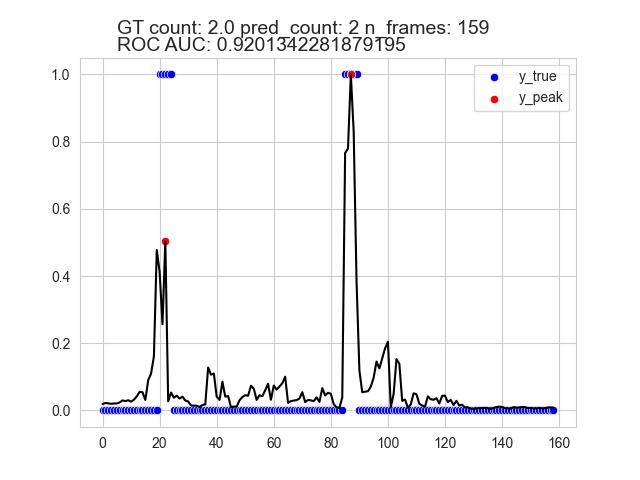
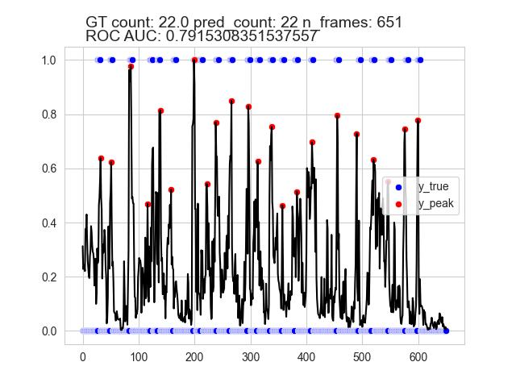

# 2023 AICUP Badminton Detection - Hit Frame Prediction

## About

A PyTorch implementation of hit frame prediction based on the video summarization framework.

## Experimentals Results




## Installation

```sh
git clone 
```

```sh
cd 2023_AICUP_BADMINTONDETECTION
pip install -r requirements.txt
```

## Preprocess Raw Data

```sh
python src/preprocess_raw.py --raw-dir /path/to/raw/data/dir --video-dir /path/to/target/video/dir --label-dir /path/to/target/label/dir
```

Example:

```sh
python src/preprocess_raw.py --raw-dir'D:/Dataset/AICUP/part1/train' --video-dir '../custom_data/videos/badminton_clean' --label-dir '../custom_data/labels/badminton_clean'
```

## Make Datasets

```sh
python src/make_dataset.py --video-dir /path/to/video/dir --label-dir /path/to/label/dir --save-path /path/to/target/h5
```

Example:

```sh
python src/make_dataset.py --video-dir '../custom_data/videos/badminton_clean' --label-dir '../custom_data/labels/badminton_clean' --save-path '../custom_data/h5/badminton_clean.h5'
```

```sh
python src/make_split.py --dataset /path/to/h5--save-path /path/to/target/yml --num-splits 1 --train-ratio 0.8
```

Example:

```sh
python src/make_split.py --dataset '../custom_data/h5/badminton_clean.h5' --save-path '../custom_data/yml/badminton_clean.yml' --num-splits 1 --train-ratio 0.8
```

## Training

```sh
python src/train.py --max-epoch 1000 --splits /path/to/yml
```

Example:

```sh
python src/train.py --max-epoch 1000 --splits '../custom_data/yml/badminton_clean.yml'
```

## Visualize Peak Detection

```sh
python src/evaluate.py --splits /path/to/yml/dir --ckpt-path /path/to/ckpt --save-dir /path/to/save/dir
```

Example:

```sh
python src/evaluate.py --splits '../custom_data/yml/badminton_clean_sub.yml' --ckpt-path '../models/checkpoint/badminton_clean_sub.yml.0.pt' --save-dir '../output_fig/test_videos'
```

## Inference

```sh
python src/infer.py --ckpt-path /path/to/ckpt --save-dir /path/to/save/dir --test-source /path/to/test/dir
```

Example:

```sh
python src/infer.py --ckpt-path '../models/checkpoint/badminton_clean_sub.yml.0.pt' --save-dir '../output_fig/test_videos' --test-source 'D:/Dataset/AICUP/part1/val'
```

## References

+ https://github.com/li-plus/DSNet/tree/master
